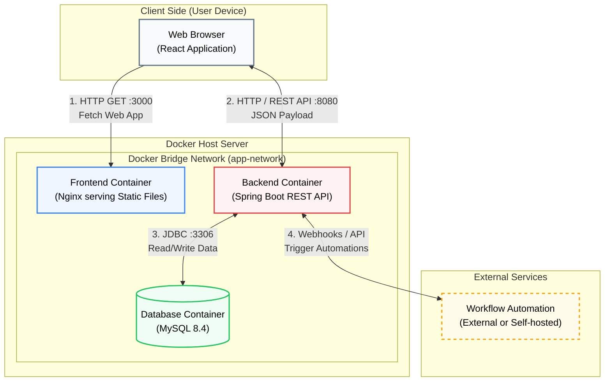

```mermaid
flowchart TD
    %% External Client
    subgraph Client ["Client Side (User Device)"]
        Browser["Web Browser\n(React Application)"]
    end

    %% Docker Host
    subgraph Server ["Docker Host Server"]
        direction TB
        
        subgraph DockerNet ["Docker Bridge Network (app-network)"]
            direction LR
            Frontend["Frontend Container\n(Nginx serving Static Files)"]
            Backend["Backend Container\n(Spring Boot REST API)"]
            DB[("Database Container\n(MySQL 8.4)")]
        end
    end

    %% External Systems
    subgraph External ["External Services"]
        MAS["Workflow Automation\n(External or Self-hosted)"]
    end

    %% Communications
    Browser -->|1. HTTP GET :3000\nFetch Web App| Frontend
    Browser <-->|2. HTTP / REST API :8080\nJSON Payload| Backend
    
    Backend <-->|3. JDBC :3306\nRead/Write Data| DB
    Backend <-->|4. Webhooks / API\nTrigger Automations| MAS

    %% Styling
    classDef client fill:#f8fafc,stroke:#64748b,color:#000,stroke-width:2px
    classDef frontend fill:#eff6ff,stroke:#3b82f6,color:#000,stroke-width:2px
    classDef backend fill:#fef2f2,stroke:#ef4444,color:#000,stroke-width:2px
    classDef db fill:#f0fdf4,stroke:#22c55e,color:#000,stroke-width:2px
    classDef ext fill:#fffbeb,stroke:#f59e0b,color:#000,stroke-width:2px,stroke-dasharray: 5 5

    class Browser client
    class Frontend frontend
    class Backend backend
    class DB db
    class MAS ext
```
