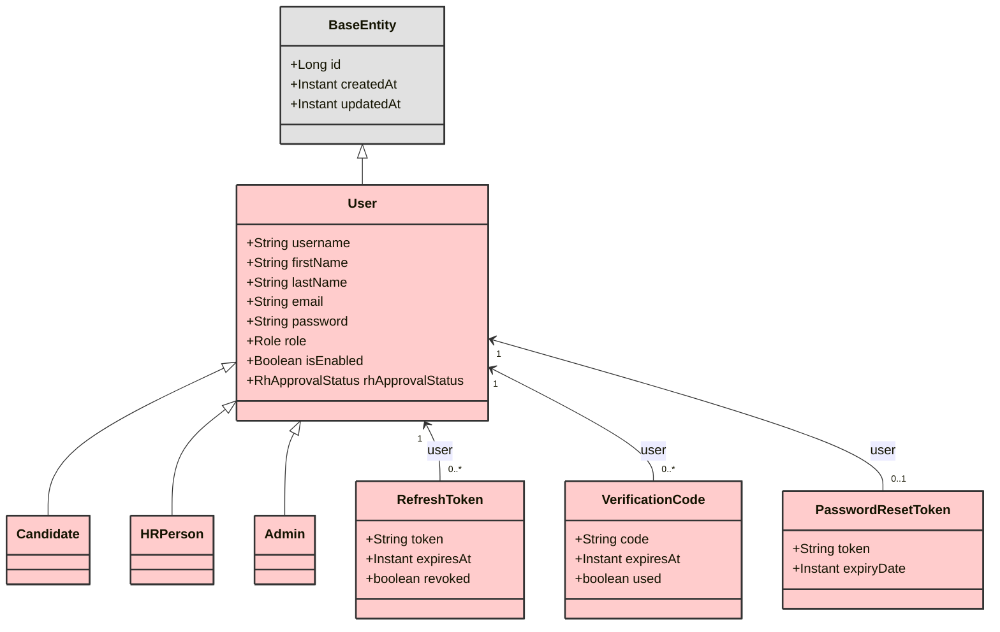

# Auth and Users Domain

```mermaid
classDiagram
  class BaseEntity {
    +Long id
    +Instant createdAt
    +Instant updatedAt
  }

  class User {
    +String username
    +String firstName
    +String lastName
    +String email
    +String password
    +Role role
    +Boolean isEnabled
    +RhApprovalStatus rhApprovalStatus
  }

  class Candidate
  class HRPerson
  class Admin

  class RefreshToken {
    +String token
    +Instant expiresAt
    +boolean revoked
  }

  class VerificationCode {
    +String code
    +Instant expiresAt
    +boolean used
  }

  class PasswordResetToken {
    +String token
    +Instant expiryDate
  }

  BaseEntity <|-- User
  
  User <|-- Candidate
  User <|-- HRPerson
  User <|-- Admin

  User "1" <-- "0..*" RefreshToken : user
  User "1" <-- "0..*" VerificationCode : user
  User "1" <-- "0..1" PasswordResetToken : user

  style BaseEntity fill:#e1e1e1,stroke:#333,stroke-width:2px
  style User fill:#ffcccc,stroke:#333,stroke-width:2px
  style Candidate fill:#ffcccc,stroke:#333,stroke-width:2px
  style HRPerson fill:#ffcccc,stroke:#333,stroke-width:2px
  style Admin fill:#ffcccc,stroke:#333,stroke-width:2px
  style RefreshToken fill:#ffcccc,stroke:#333,stroke-width:2px
  style VerificationCode fill:#ffcccc,stroke:#333,stroke-width:2px
  style PasswordResetToken fill:#ffcccc,stroke:#333,stroke-width:2px
```
