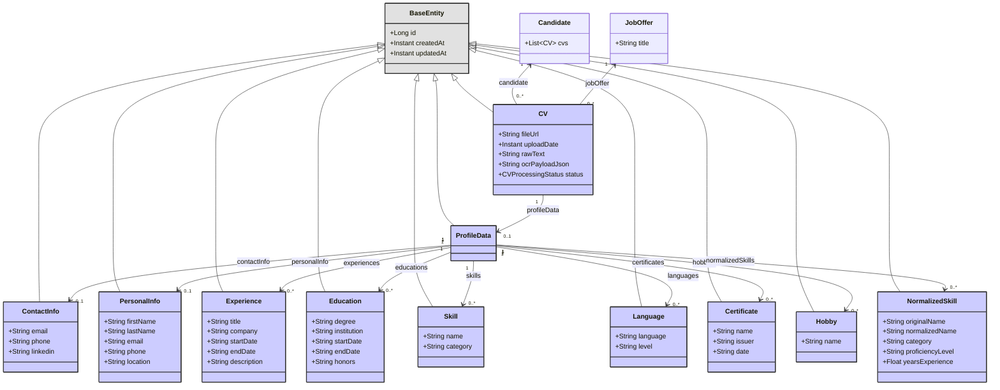

# Resumes and Profile Data Domain

```mermaid
classDiagram
  class BaseEntity {
    +Long id
    +Instant createdAt
    +Instant updatedAt
  }

  class Candidate {
    +List~CV~ cvs
  }
  
  class JobOffer {
    +String title
  }

  class CV {
    +String fileUrl
    +Instant uploadDate
    +String rawText
    +String ocrPayloadJson
    +CVProcessingStatus status
  }

  class ProfileData {
  }

  class ContactInfo {
    +String email
    +String phone
    +String linkedin
  }

  class PersonalInfo {
    +String firstName
    +String lastName
    +String email
    +String phone
    +String location
  }

  class Experience {
    +String title
    +String company
    +String startDate
    +String endDate
    +String description
  }

  class Education {
    +String degree
    +String institution
    +String startDate
    +String endDate
    +String honors
  }

  class Skill {
    +String name
    +String category
  }

  class Language {
    +String language
    +String level
  }

  class Certificate {
    +String name
    +String issuer
    +String date
  }

  class Hobby {
    +String name
  }

  class NormalizedSkill {
    +String originalName
    +String normalizedName
    +String category
    +String proficiencyLevel
    +Float yearsExperience
  }

  BaseEntity <|-- CV
  BaseEntity <|-- ProfileData
  BaseEntity <|-- ContactInfo
  BaseEntity <|-- PersonalInfo
  BaseEntity <|-- Experience
  BaseEntity <|-- Education
  BaseEntity <|-- Skill
  BaseEntity <|-- Language
  BaseEntity <|-- Certificate
  BaseEntity <|-- Hobby
  BaseEntity <|-- NormalizedSkill

  Candidate "1" <-- "0..*" CV : candidate
  JobOffer "1" <-- "0..*" CV : jobOffer
  CV "1" --> "0..1" ProfileData : profileData
  ProfileData "1" --> "0..1" ContactInfo : contactInfo
  ProfileData "1" --> "0..1" PersonalInfo : personalInfo
  ProfileData "1" --> "0..*" Experience : experiences
  ProfileData "1" --> "0..*" Education : educations
  ProfileData "1" --> "0..*" Skill : skills
  ProfileData "1" --> "0..*" Language : languages
  ProfileData "1" --> "0..*" Certificate : certificates
  ProfileData "1" --> "0..*" Hobby : hobbies
  ProfileData "1" --> "0..*" NormalizedSkill : normalizedSkills

  style BaseEntity fill:#e1e1e1,stroke:#333,stroke-width:2px
  style CV fill:#ccccff,stroke:#333,stroke-width:2px
  style ProfileData fill:#ccccff,stroke:#333,stroke-width:2px
  style ContactInfo fill:#ccccff,stroke:#333,stroke-width:2px
  style PersonalInfo fill:#ccccff,stroke:#333,stroke-width:2px
  style Experience fill:#ccccff,stroke:#333,stroke-width:2px
  style Education fill:#ccccff,stroke:#333,stroke-width:2px
  style Skill fill:#ccccff,stroke:#333,stroke-width:2px
  style Language fill:#ccccff,stroke:#333,stroke-width:2px
  style Certificate fill:#ccccff,stroke:#333,stroke-width:2px
  style Hobby fill:#ccccff,stroke:#333,stroke-width:2px
  style NormalizedSkill fill:#ccccff,stroke:#333,stroke-width:2px
```
