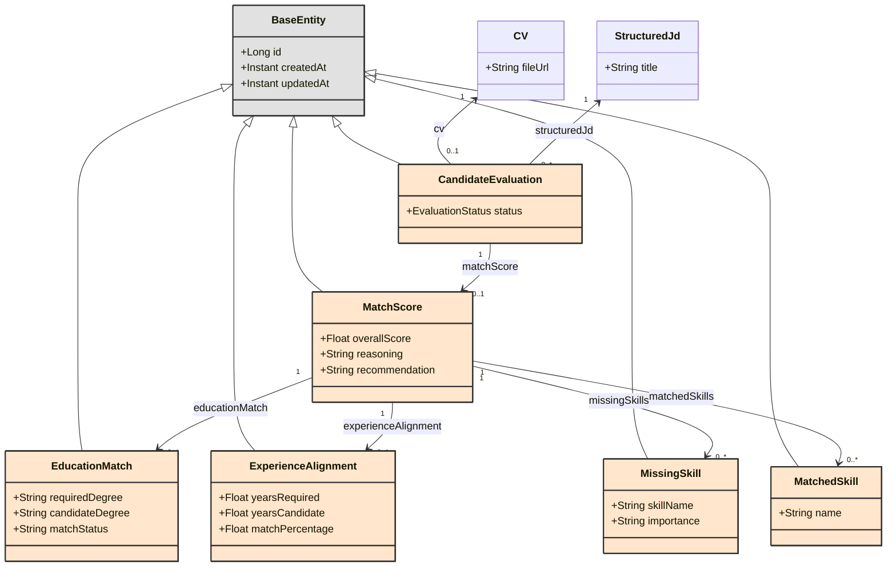

# Evaluation and Matching Domain

```mermaid
classDiagram
  class BaseEntity {
    +Long id
    +Instant createdAt
    +Instant updatedAt
  }

  class CV {
    +String fileUrl
  }

  class StructuredJd {
    +String title
  }

  class CandidateEvaluation {
    +EvaluationStatus status
  }

  class MatchScore {
    +Float overallScore
    +String reasoning
    +String recommendation
  }

  class EducationMatch {
    +String requiredDegree
    +String candidateDegree
    +String matchStatus
  }

  class ExperienceAlignment {
    +Float yearsRequired
    +Float yearsCandidate
    +Float matchPercentage
  }

  class MissingSkill {
    +String skillName
    +String importance
  }

  class MatchedSkill {
    +String name
  }

  BaseEntity <|-- CandidateEvaluation
  BaseEntity <|-- MatchScore
  BaseEntity <|-- EducationMatch
  BaseEntity <|-- ExperienceAlignment
  BaseEntity <|-- MissingSkill
  BaseEntity <|-- MatchedSkill

  CV "1" <-- "0..1" CandidateEvaluation : cv
  StructuredJd "1" <-- "0..*" CandidateEvaluation : structuredJd
  CandidateEvaluation "1" --> "0..1" MatchScore : matchScore
  MatchScore "1" --> "0..1" EducationMatch : educationMatch
  MatchScore "1" --> "0..1" ExperienceAlignment : experienceAlignment
  MatchScore "1" --> "0..*" MissingSkill : missingSkills
  MatchScore "1" --> "0..*" MatchedSkill : matchedSkills

  style BaseEntity fill:#e1e1e1,stroke:#333,stroke-width:2px
  style CandidateEvaluation fill:#ffe6cc,stroke:#333,stroke-width:2px
  style MatchScore fill:#ffe6cc,stroke:#333,stroke-width:2px
  style EducationMatch fill:#ffe6cc,stroke:#333,stroke-width:2px
  style ExperienceAlignment fill:#ffe6cc,stroke:#333,stroke-width:2px
  style MissingSkill fill:#ffe6cc,stroke:#333,stroke-width:2px
  style MatchedSkill fill:#ffe6cc,stroke:#333,stroke-width:2px
```
