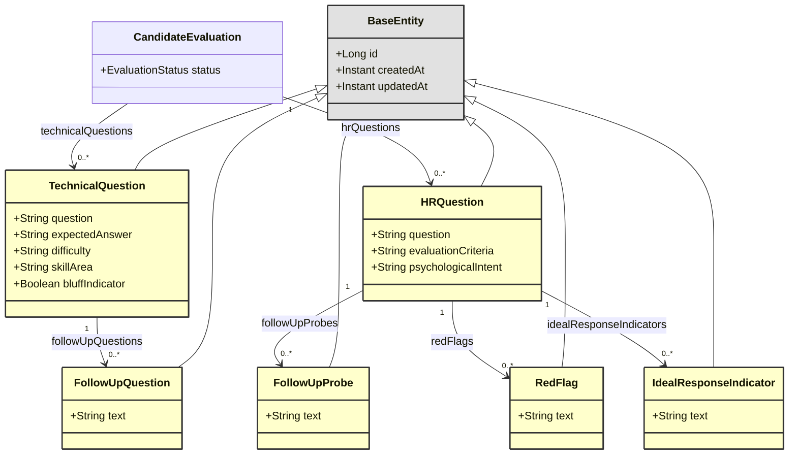

# Questions and Interviews Domain

```mermaid
classDiagram
  class BaseEntity {
    +Long id
    +Instant createdAt
    +Instant updatedAt
  }

  class CandidateEvaluation {
    +EvaluationStatus status
  }

  class TechnicalQuestion {
    +String question
    +String expectedAnswer
    +String difficulty
    +String skillArea
    +Boolean bluffIndicator
  }

  class FollowUpQuestion {
    +String text
  }

  class HRQuestion {
    +String question
    +String evaluationCriteria
    +String psychologicalIntent
  }

  class FollowUpProbe {
    +String text
  }

  class RedFlag {
    +String text
  }

  class IdealResponseIndicator {
    +String text
  }

  BaseEntity <|-- TechnicalQuestion
  BaseEntity <|-- FollowUpQuestion
  BaseEntity <|-- HRQuestion
  BaseEntity <|-- FollowUpProbe
  BaseEntity <|-- RedFlag
  BaseEntity <|-- IdealResponseIndicator

  CandidateEvaluation "1" --> "0..*" TechnicalQuestion : technicalQuestions
  CandidateEvaluation "1" --> "0..*" HRQuestion : hrQuestions
  TechnicalQuestion "1" --> "0..*" FollowUpQuestion : followUpQuestions
  HRQuestion "1" --> "0..*" FollowUpProbe : followUpProbes
  HRQuestion "1" --> "0..*" RedFlag : redFlags
  HRQuestion "1" --> "0..*" IdealResponseIndicator : idealResponseIndicators

  style BaseEntity fill:#e1e1e1,stroke:#333,stroke-width:2px
  style TechnicalQuestion fill:#ffffcc,stroke:#333,stroke-width:2px
  style FollowUpQuestion fill:#ffffcc,stroke:#333,stroke-width:2px
  style HRQuestion fill:#ffffcc,stroke:#333,stroke-width:2px
  style FollowUpProbe fill:#ffffcc,stroke:#333,stroke-width:2px
  style RedFlag fill:#ffffcc,stroke:#333,stroke-width:2px
  style IdealResponseIndicator fill:#ffffcc,stroke:#333,stroke-width:2px
```
