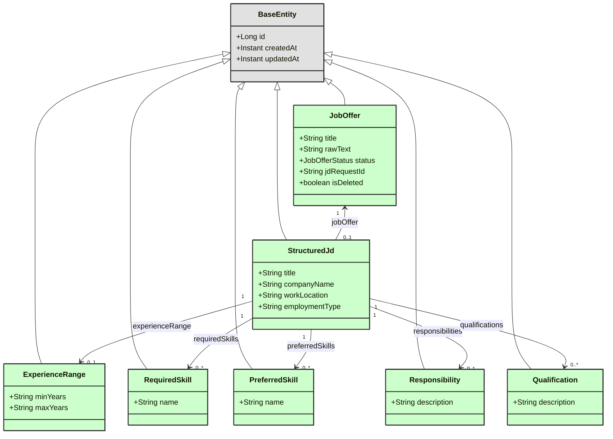

# Jobs and Job Descriptions Domain

```mermaid
classDiagram
  class BaseEntity {
    +Long id
    +Instant createdAt
    +Instant updatedAt
  }

  class JobOffer {
    +String title
    +String rawText
    +JobOfferStatus status
    +String jdRequestId
    +boolean isDeleted
  }

  class StructuredJd {
    +String title
    +String companyName
    +String workLocation
    +String employmentType
  }

  class ExperienceRange {
    +String minYears
    +String maxYears
  }

  class RequiredSkill {
    +String name
  }

  class PreferredSkill {
    +String name
  }

  class Responsibility {
    +String description
  }

  class Qualification {
    +String description
  }

  BaseEntity <|-- JobOffer
  BaseEntity <|-- StructuredJd
  BaseEntity <|-- ExperienceRange
  BaseEntity <|-- RequiredSkill
  BaseEntity <|-- PreferredSkill
  BaseEntity <|-- Responsibility
  BaseEntity <|-- Qualification

  JobOffer "1" <-- "0..1" StructuredJd : jobOffer
  StructuredJd "1" --> "0..1" ExperienceRange : experienceRange
  StructuredJd "1" --> "0..*" RequiredSkill : requiredSkills
  StructuredJd "1" --> "0..*" PreferredSkill : preferredSkills
  StructuredJd "1" --> "0..*" Responsibility : responsibilities
  StructuredJd "1" --> "0..*" Qualification : qualifications

  style BaseEntity fill:#e1e1e1,stroke:#333,stroke-width:2px
  style JobOffer fill:#ccffcc,stroke:#333,stroke-width:2px
  style StructuredJd fill:#ccffcc,stroke:#333,stroke-width:2px
  style ExperienceRange fill:#ccffcc,stroke:#333,stroke-width:2px
  style RequiredSkill fill:#ccffcc,stroke:#333,stroke-width:2px
  style PreferredSkill fill:#ccffcc,stroke:#333,stroke-width:2px
  style Responsibility fill:#ccffcc,stroke:#333,stroke-width:2px
  style Qualification fill:#ccffcc,stroke:#333,stroke-width:2px
```
