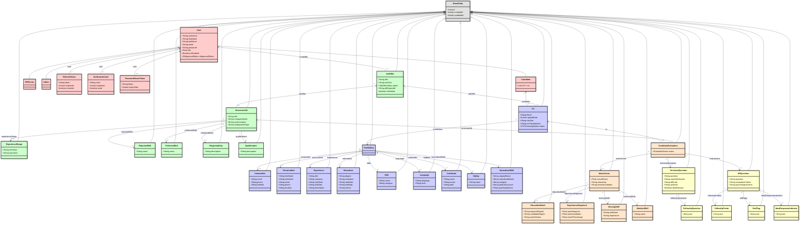

```mermaid
classDiagram
  class BaseEntity {
    +Long id
    +Instant createdAt
    +Instant updatedAt
  }

  class User {
    +String username
    +String firstName
    +String lastName
    +String email
    +String password
    +Role role
    +Boolean isEnabled
    +RhApprovalStatus rhApprovalStatus
  }

  class Candidate {
    +List~CV~ cvs
  }

  class HRPerson
  class Admin

  class RefreshToken {
    +String token
    +Instant expiresAt
    +boolean revoked
  }

  class VerificationCode {
    +String code
    +Instant expiresAt
    +boolean used
  }

  class PasswordResetToken {
    +String token
    +Instant expiryDate
  }

  class JobOffer {
    +String title
    +String rawText
    +JobOfferStatus status
    +String jdRequestId
    +boolean isDeleted
  }

  class StructuredJd {
    +String title
    +String companyName
    +String workLocation
    +String employmentType
  }

  class ExperienceRange {
    +String minYears
    +String maxYears
  }

  class RequiredSkill {
    +String name
  }

  class PreferredSkill {
    +String name
  }

  class Responsibility {
    +String description
  }

  class Qualification {
    +String description
  }

  class CV {
    +String fileUrl
    +Instant uploadDate
    +String rawText
    +String ocrPayloadJson
    +CVProcessingStatus status
  }

  class ProfileData {
  }

  class ContactInfo {
    +String email
    +String phone
    +String linkedin
  }

  class PersonalInfo {
    +String firstName
    +String lastName
    +String email
    +String phone
    +String location
  }

  class Experience {
    +String title
    +String company
    +String startDate
    +String endDate
    +String description
  }

  class Education {
    +String degree
    +String institution
    +String startDate
    +String endDate
    +String honors
  }

  class Skill {
    +String name
    +String category
  }

  class Language {
    +String language
    +String level
  }

  class Certificate {
    +String name
    +String issuer
    +String date
  }

  class Hobby {
    +String name
  }

  class NormalizedSkill {
    +String originalName
    +String normalizedName
    +String category
    +String proficiencyLevel
    +Float yearsExperience
  }

  class CandidateEvaluation {
    +EvaluationStatus status
  }

  class MatchScore {
    +Float overallScore
    +String reasoning
    +String recommendation
  }

  class EducationMatch {
    +String requiredDegree
    +String candidateDegree
    +String matchStatus
  }

  class ExperienceAlignment {
    +Float yearsRequired
    +Float yearsCandidate
    +Float matchPercentage
  }

  class MissingSkill {
    +String skillName
    +String importance
  }

  class MatchedSkill {
    +String name
  }

  class TechnicalQuestion {
    +String question
    +String expectedAnswer
    +String difficulty
    +String skillArea
    +Boolean bluffIndicator
  }

  class FollowUpQuestion {
    +String text
  }

  class HRQuestion {
    +String question
    +String evaluationCriteria
    +String psychologicalIntent
  }

  class FollowUpProbe {
    +String text
  }

  class RedFlag {
    +String text
  }

  class IdealResponseIndicator {
    +String text
  }

  BaseEntity <|-- User
  BaseEntity <|-- JobOffer
  BaseEntity <|-- StructuredJd
  BaseEntity <|-- ExperienceRange
  BaseEntity <|-- RequiredSkill
  BaseEntity <|-- PreferredSkill
  BaseEntity <|-- Responsibility
  BaseEntity <|-- Qualification
  BaseEntity <|-- CV
  BaseEntity <|-- ProfileData
  BaseEntity <|-- ContactInfo
  BaseEntity <|-- PersonalInfo
  BaseEntity <|-- Experience
  BaseEntity <|-- Education
  BaseEntity <|-- Skill
  BaseEntity <|-- Language
  BaseEntity <|-- Certificate
  BaseEntity <|-- Hobby
  BaseEntity <|-- NormalizedSkill
  BaseEntity <|-- CandidateEvaluation
  BaseEntity <|-- MatchScore
  BaseEntity <|-- EducationMatch
  BaseEntity <|-- ExperienceAlignment
  BaseEntity <|-- MissingSkill
  BaseEntity <|-- MatchedSkill
  BaseEntity <|-- TechnicalQuestion
  BaseEntity <|-- FollowUpQuestion
  BaseEntity <|-- HRQuestion
  BaseEntity <|-- FollowUpProbe
  BaseEntity <|-- RedFlag
  BaseEntity <|-- IdealResponseIndicator

  User <|-- Candidate
  User <|-- HRPerson
  User <|-- Admin

  User "1" <-- "0..*" RefreshToken : user
  User "1" <-- "0..*" VerificationCode : user
  User "1" <-- "0..1" PasswordResetToken : user
  User "1" <-- "0..*" JobOffer : createdBy

  JobOffer "1" <-- "0..1" StructuredJd : jobOffer
  JobOffer "1" <-- "0..*" CV : jobOffer

  StructuredJd "1" --> "0..1" ExperienceRange : experienceRange
  StructuredJd "1" --> "0..*" RequiredSkill : requiredSkills
  StructuredJd "1" --> "0..*" PreferredSkill : preferredSkills
  StructuredJd "1" --> "0..*" Responsibility : responsibilities
  StructuredJd "1" --> "0..*" Qualification : qualifications
  StructuredJd "1" <-- "0..*" CandidateEvaluation : structuredJd

  Candidate "1" <-- "0..*" CV : candidate
  CV "1" --> "0..1" ProfileData : profileData
  CV "1" <-- "0..1" CandidateEvaluation : cv

  ProfileData "1" --> "0..1" ContactInfo : contactInfo
  ProfileData "1" --> "0..1" PersonalInfo : personalInfo
  ProfileData "1" --> "0..*" Experience : experiences
  ProfileData "1" --> "0..*" Education : educations
  ProfileData "1" --> "0..*" Skill : skills
  ProfileData "1" --> "0..*" Language : languages
  ProfileData "1" --> "0..*" Certificate : certificates
  ProfileData "1" --> "0..*" Hobby : hobbies
  ProfileData "1" --> "0..*" NormalizedSkill : normalizedSkills

  CandidateEvaluation "1" --> "0..1" MatchScore : matchScore
  CandidateEvaluation "1" --> "0..*" TechnicalQuestion : technicalQuestions
  CandidateEvaluation "1" --> "0..*" HRQuestion : hrQuestions

  MatchScore "1" --> "0..1" EducationMatch : educationMatch
  MatchScore "1" --> "0..1" ExperienceAlignment : experienceAlignment
  MatchScore "1" --> "0..*" MissingSkill : missingSkills
  MatchScore "1" --> "0..*" MatchedSkill : matchedSkills

  TechnicalQuestion "1" --> "0..*" FollowUpQuestion : followUpQuestions
  
  HRQuestion "1" --> "0..*" FollowUpProbe : followUpProbes
  HRQuestion "1" --> "0..*" RedFlag : redFlags
  HRQuestion "1" --> "0..*" IdealResponseIndicator : idealResponseIndicators

  %% Styling the different domains for clarity
  style BaseEntity fill:#e1e1e1,stroke:#333,stroke-width:2px

  %% Auth and Users (Pink/Red)
  style User fill:#ffcccc,stroke:#333,stroke-width:2px
  style Candidate fill:#ffcccc,stroke:#333,stroke-width:2px
  style HRPerson fill:#ffcccc,stroke:#333,stroke-width:2px
  style Admin fill:#ffcccc,stroke:#333,stroke-width:2px
  style RefreshToken fill:#ffcccc,stroke:#333,stroke-width:2px
  style VerificationCode fill:#ffcccc,stroke:#333,stroke-width:2px
  style PasswordResetToken fill:#ffcccc,stroke:#333,stroke-width:2px

  %% Jobs and JDs (Green)
  style JobOffer fill:#ccffcc,stroke:#333,stroke-width:2px
  style StructuredJd fill:#ccffcc,stroke:#333,stroke-width:2px
  style ExperienceRange fill:#ccffcc,stroke:#333,stroke-width:2px
  style RequiredSkill fill:#ccffcc,stroke:#333,stroke-width:2px
  style PreferredSkill fill:#ccffcc,stroke:#333,stroke-width:2px
  style Responsibility fill:#ccffcc,stroke:#333,stroke-width:2px
  style Qualification fill:#ccffcc,stroke:#333,stroke-width:2px

  %% Resumes and Profile Data (Purple/Blue)
  style CV fill:#ccccff,stroke:#333,stroke-width:2px
  style ProfileData fill:#ccccff,stroke:#333,stroke-width:2px
  style ContactInfo fill:#ccccff,stroke:#333,stroke-width:2px
  style PersonalInfo fill:#ccccff,stroke:#333,stroke-width:2px
  style Experience fill:#ccccff,stroke:#333,stroke-width:2px
  style Education fill:#ccccff,stroke:#333,stroke-width:2px
  style Skill fill:#ccccff,stroke:#333,stroke-width:2px
  style Language fill:#ccccff,stroke:#333,stroke-width:2px
  style Certificate fill:#ccccff,stroke:#333,stroke-width:2px
  style Hobby fill:#ccccff,stroke:#333,stroke-width:2px
  style NormalizedSkill fill:#ccccff,stroke:#333,stroke-width:2px

  %% Evaluation and Matching (Orange)
  style CandidateEvaluation fill:#ffe6cc,stroke:#333,stroke-width:2px
  style MatchScore fill:#ffe6cc,stroke:#333,stroke-width:2px
  style EducationMatch fill:#ffe6cc,stroke:#333,stroke-width:2px
  style ExperienceAlignment fill:#ffe6cc,stroke:#333,stroke-width:2px
  style MissingSkill fill:#ffe6cc,stroke:#333,stroke-width:2px
  style MatchedSkill fill:#ffe6cc,stroke:#333,stroke-width:2px

  %% Questions and Interviews (Yellow)
  style TechnicalQuestion fill:#ffffcc,stroke:#333,stroke-width:2px
  style FollowUpQuestion fill:#ffffcc,stroke:#333,stroke-width:2px
  style HRQuestion fill:#ffffcc,stroke:#333,stroke-width:2px
  style FollowUpProbe fill:#ffffcc,stroke:#333,stroke-width:2px
  style RedFlag fill:#ffffcc,stroke:#333,stroke-width:2px
  style IdealResponseIndicator fill:#ffffcc,stroke:#333,stroke-width:2px
```