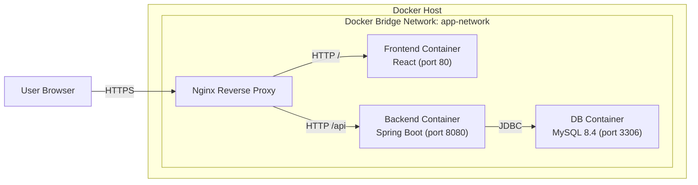

```mermaid
flowchart LR
  User[User Browser]

  subgraph DockerHost["Docker Host"]
    subgraph Network["Docker Bridge Network: app-network"]
      Nginx["Nginx Reverse Proxy"]
      Frontend["Frontend Container\nReact (port 80)"]
      Backend["Backend Container\nSpring Boot (port 8080)"]
      DB["DB Container\nMySQL 8.4 (port 3306)"]
    end
  end

  User -->|HTTPS| Nginx
  Nginx -->|HTTP /| Frontend
  Nginx -->|HTTP /api| Backend
  Backend -->|JDBC| DB
```
