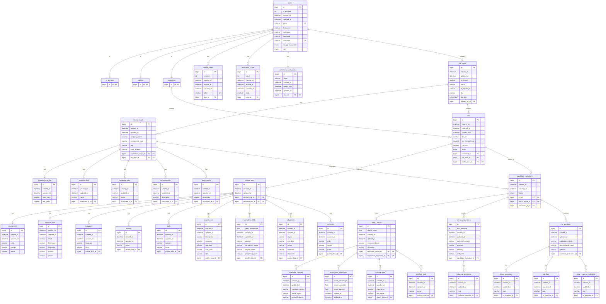

```mermaid
erDiagram
    users {
        bigint id PK
        bit is_enabled
        datetime created_at
        datetime updated_at
        varchar email "UK"
        varchar first_name
        varchar last_name
        varchar password
        varchar username "UK"
        enum rh_approval_status
        enum role
    }

    contact_info {
        bigint id PK
        datetime created_at
        datetime updated_at
        varchar email
        varchar linkedin
        varchar phone
    }

    education_matches {
        bigint id PK
        datetime created_at
        datetime updated_at
        varchar candidate_degree
        varchar match_status
        varchar required_degree
    }

    experience_alignments {
        bigint id PK
        float match_percentage
        float years_candidate
        float years_required
        datetime created_at
        datetime updated_at
    }

    experience_ranges {
        bigint id PK
        datetime created_at
        datetime updated_at
        varchar max_years
        varchar min_years
    }

    personal_info {
        bigint id PK
        datetime created_at
        datetime updated_at
        varchar email
        varchar first_name
        varchar last_name
        varchar location
        varchar phone
    }

    match_scores {
        bigint id PK
        float overall_score
        datetime created_at
        datetime updated_at
        varchar recommendation
        varchar reasoning
        bigint education_match_id FK "UK"
        bigint experience_alignment_id FK "UK"
    }

    profile_data {
        bigint id PK
        datetime created_at
        datetime updated_at
        bigint contact_info_id FK "UK"
        bigint personal_info_id FK "UK"
    }

    hr_persons {
        bigint id PK,FK
    }

    job_offers {
        bigint id PK
        datetime created_at
        datetime updated_at
        boolean is_deleted
        varchar status
        varchar jd_request_id
        varchar title
        LONGTEXT raw_text
        bigint created_by_id FK
    }

    refresh_tokens {
        bigint id PK
        bit revoked
        datetime created_at
        datetime expires_at
        datetime updated_at
        varchar token "UK"
        bigint user_id FK
    }

    admins {
        bigint id PK,FK
    }

    candidates {
        bigint id PK,FK
    }

    verification_codes {
        bigint id PK
        bit used
        datetime created_at
        datetime expires_at
        datetime updated_at
        varchar code
        bigint user_id FK
    }

    password_reset_tokens {
        bigint id PK
        varchar token
        datetime created_at
        datetime expiry_date
        datetime updated_at
        bigint user_id FK "UK"
    }

    missing_skills {
        bigint id PK
        datetime created_at
        datetime updated_at
        varchar importance
        varchar skill_name
        bigint match_score_id FK
    }

    matched_skills {
        bigint id PK
        datetime created_at
        datetime updated_at
        varchar name
        bigint match_score_id FK
    }

    languages {
        bigint id PK
        datetime created_at
        datetime updated_at
        varchar language
        varchar level
        bigint profile_data_id FK
    }

    hobbies {
        bigint id PK
        datetime created_at
        datetime updated_at
        varchar name
        bigint profile_data_id FK
    }

    skills {
        bigint id PK
        datetime created_at
        datetime updated_at
        varchar category
        varchar name
        bigint profile_data_id FK
    }

    experiences {
        bigint id PK
        datetime created_at
        datetime updated_at
        varchar description
        varchar company
        varchar end_date
        varchar start_date
        varchar title
        bigint profile_data_id FK
    }

    normalized_skills {
        bigint id PK
        float years_experience
        datetime created_at
        datetime updated_at
        varchar category
        varchar normalized_name
        varchar original_name
        varchar proficiency_level
        bigint profile_data_id FK
    }

    educations {
        bigint id PK
        datetime created_at
        datetime updated_at
        varchar degree
        varchar end_date
        varchar honors
        varchar institution
        varchar start_date
        bigint profile_data_id FK
    }

    certificates {
        bigint id PK
        datetime created_at
        datetime updated_at
        varchar date
        varchar issuer
        varchar name
        bigint profile_data_id FK
    }

    structured_jds {
        bigint id PK
        datetime created_at
        datetime updated_at
        varchar company_name
        varchar employment_type
        varchar title
        varchar work_location
        bigint experience_range_id FK "UK"
        bigint job_offer_id FK "UK"
    }

    cvs {
        bigint id PK
        datetime created_at
        datetime updated_at
        datetime upload_date
        varchar file_url
        longtext ocr_payload_json
        longtext raw_text
        enum status
        bigint candidate_id FK
        bigint job_offer_id FK
        bigint profile_data_id FK "UK"
    }

    required_skills {
        bigint id PK
        datetime created_at
        datetime updated_at
        varchar name
        bigint structured_jd_id FK
    }

    preferred_skills {
        bigint id PK
        datetime created_at
        datetime updated_at
        varchar name
        bigint structured_jd_id FK
    }

    qualifications {
        bigint id PK
        datetime created_at
        datetime updated_at
        varchar description
        bigint structured_jd_id FK
    }

    responsibilities {
        bigint id PK
        datetime created_at
        datetime updated_at
        varchar description
        bigint structured_jd_id FK
    }

    candidate_evaluations {
        bigint id PK
        datetime created_at
        datetime updated_at
        enum status
        bigint cv_id FK "UK"
        bigint match_score_id FK "UK"
        bigint structured_jd_id FK
    }

    technical_questions {
        bigint id PK
        bit bluff_indicator
        datetime created_at
        datetime updated_at
        varchar expected_answer
        varchar question
        varchar difficulty
        varchar skill_area
        bigint candidate_evaluation_id FK
    }

    hr_questions {
        bigint id PK
        datetime created_at
        datetime updated_at
        varchar evaluation_criteria
        varchar psychological_intent
        varchar question
        bigint candidate_evaluation_id FK
    }

    follow_up_questions {
        bigint id PK
        datetime created_at
        datetime updated_at
        varchar text
        bigint technical_question_id FK
    }

    follow_up_probes {
        bigint id PK
        datetime created_at
        datetime updated_at
        varchar text
        bigint hr_question_id FK
    }

    red_flags {
        bigint id PK
        datetime created_at
        datetime updated_at
        varchar text
        bigint hr_question_id FK
    }

    ideal_response_indicators {
        bigint id PK
        datetime created_at
        datetime updated_at
        varchar text
        bigint hr_question_id FK
    }

    %% Relationships

    users ||--|| hr_persons : "is"
    users ||--|| admins : "is"
    users ||--|| candidates : "is"
    
    users ||--o{ refresh_tokens : "has"
    users ||--o{ verification_codes : "has"
    users ||--|| password_reset_tokens : "has"
    users ||--o{ job_offers : "creates"
    
    match_scores ||--o| education_matches : "has"
    match_scores ||--o| experience_alignments : "has"
    match_scores ||--o{ missing_skills : "has"
    match_scores ||--o{ matched_skills : "has"
    
    profile_data ||--o| contact_info : "has"
    profile_data ||--o| personal_info : "has"
    profile_data ||--o{ languages : "has"
    profile_data ||--o{ hobbies : "has"
    profile_data ||--o{ skills : "has"
    profile_data ||--o{ experiences : "has"
    profile_data ||--o{ normalized_skills : "has"
    profile_data ||--o{ educations : "has"
    profile_data ||--o{ certificates : "has"

    job_offers ||--o| structured_jds : "has"
    job_offers ||--o{ cvs : "receives"

    structured_jds ||--o| experience_ranges : "has"
    structured_jds ||--o{ required_skills : "has"
    structured_jds ||--o{ preferred_skills : "has"
    structured_jds ||--o{ responsibilities : "has"
    structured_jds ||--o{ qualifications : "has"
    structured_jds ||--o{ candidate_evaluations : "evaluates"
    
    candidates ||--o{ cvs : "submits"
    cvs ||--o| profile_data : "extracts"
    cvs ||--o| candidate_evaluations : "results_in"
    
    candidate_evaluations ||--o| match_scores : "has"
    candidate_evaluations ||--o{ technical_questions : "includes"
    candidate_evaluations ||--o{ hr_questions : "includes"
    
    technical_questions ||--o{ follow_up_questions : "has"
    hr_questions ||--o{ follow_up_probes : "has"
    hr_questions ||--o{ red_flags : "has"
    hr_questions ||--o{ ideal_response_indicators : "has"
```
