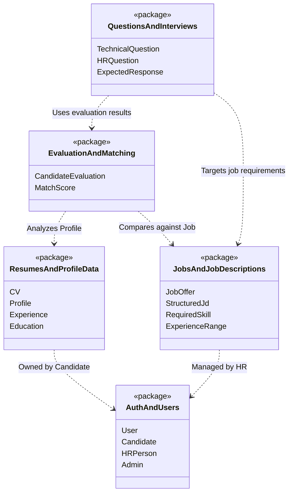

# Domain Package Diagram

This UML Package Diagram illustrates how the business domain packages interact and depend on each other within the system.

```mermaid
classDiagram
    class AuthAndUsers {
        <<package>>
        User
        Candidate
        HRPerson
        Admin
    }
    
    class JobsAndJobDescriptions {
        <<package>>
        JobOffer
        StructuredJd
        RequiredSkill
        ExperienceRange
    }
    
    class ResumesAndProfileData {
        <<package>>
        CV
        Profile
        Experience
        Education
    }
    
    class EvaluationAndMatching {
        <<package>>
        CandidateEvaluation
        MatchScore
    }
    
    class QuestionsAndInterviews {
        <<package>>
        TechnicalQuestion
        HRQuestion
        ExpectedResponse
    }

    %% Package Interactions and Dependencies
    JobsAndJobDescriptions ..> AuthAndUsers : Managed by HR
    ResumesAndProfileData ..> AuthAndUsers : Owned by Candidate
    
    EvaluationAndMatching ..> ResumesAndProfileData : Analyzes Profile
    EvaluationAndMatching ..> JobsAndJobDescriptions : Compares against Job
    
    QuestionsAndInterviews ..> EvaluationAndMatching : Uses evaluation results
    QuestionsAndInterviews ..> JobsAndJobDescriptions : Targets job requirements
```
