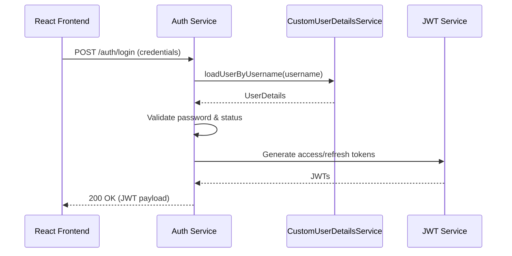

```mermaid
sequenceDiagram
  participant FE as React Frontend
  participant Auth as Auth Service
  participant UDS as CustomUserDetailsService
  participant JWT as JWT Service

  FE->>Auth: POST /auth/login (credentials)
  Auth->>UDS: loadUserByUsername(username)
  UDS-->>Auth: UserDetails
  Auth->>Auth: Validate password & status
  Auth->>JWT: Generate access/refresh tokens
  JWT-->>Auth: JWTs
  Auth-->>FE: 200 OK (JWT payload)
```
