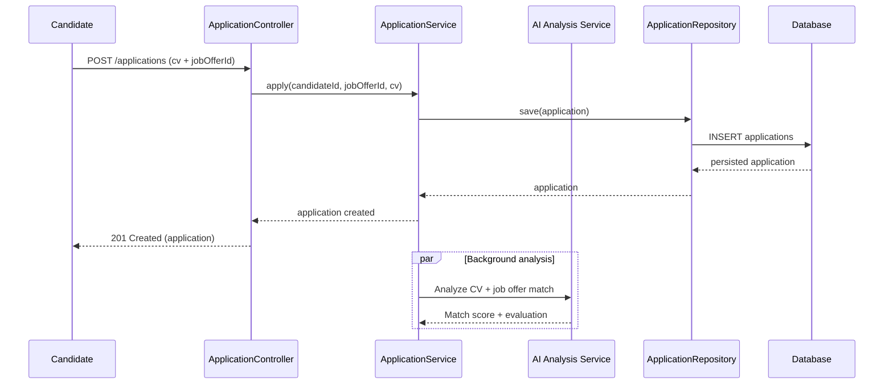

```mermaid
sequenceDiagram
  participant Cand as Candidate
  participant C as ApplicationController
  participant S as ApplicationService
  participant AI as AI Analysis Service
  participant R as ApplicationRepository
  participant DB as Database

  Cand->>C: POST /applications (cv + jobOfferId)
  C->>S: apply(candidateId, jobOfferId, cv)
  S->>R: save(application)
  R->>DB: INSERT applications
  DB-->>R: persisted application
  R-->>S: application
  S-->>C: application created
  C-->>Cand: 201 Created (application)

  par Background analysis
    S->>AI: Analyze CV + job offer match
    AI-->>S: Match score + evaluation
  end
```
