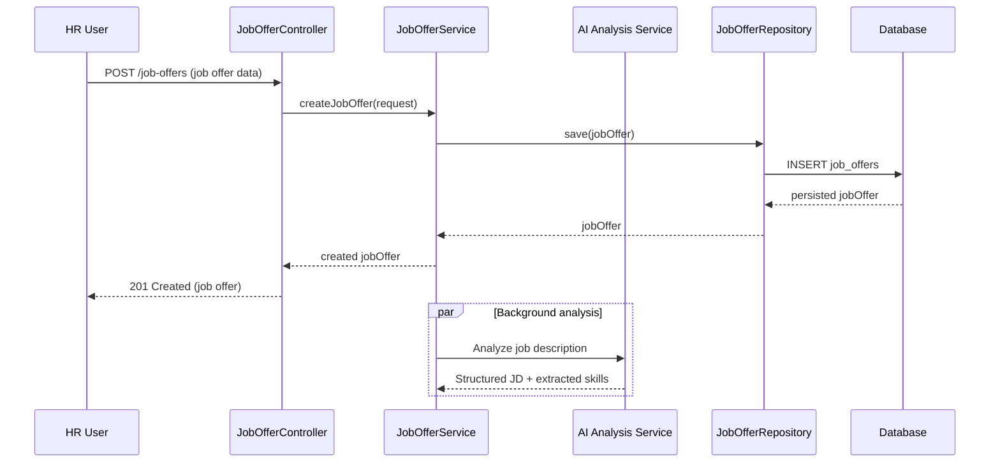

```mermaid
sequenceDiagram
  participant HR as HR User
  participant C as JobOfferController
  participant S as JobOfferService
  participant AI as AI Analysis Service
  participant R as JobOfferRepository
  participant DB as Database

  HR->>C: POST /job-offers (job offer data)
  C->>S: createJobOffer(request)
  S->>R: save(jobOffer)
  R->>DB: INSERT job_offers
  DB-->>R: persisted jobOffer
  R-->>S: jobOffer
  S-->>C: created jobOffer
  C-->>HR: 201 Created (job offer)

  par Background analysis
    S->>AI: Analyze job description
    AI-->>S: Structured JD + extracted skills
  end
```
