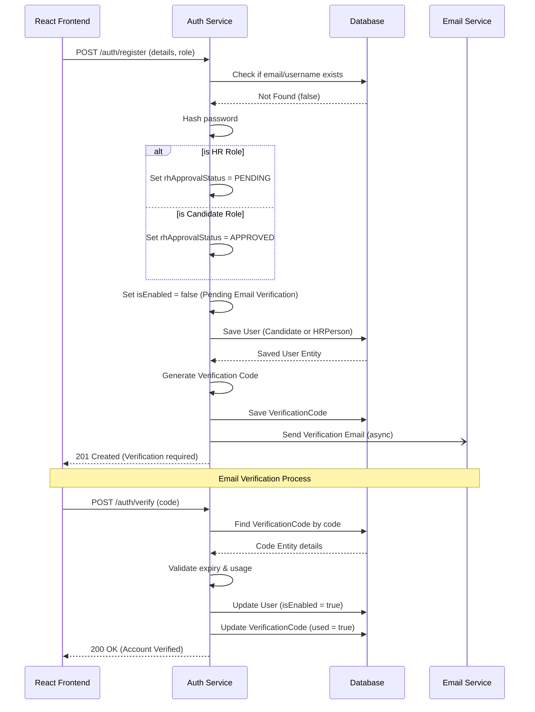

```mermaid
sequenceDiagram
  participant FE as React Frontend
  participant Auth as Auth Service
  participant DB as Database
  participant Mail as Email Service

  FE->>Auth: POST /auth/register (details, role)
  Auth->>DB: Check if email/username exists
  DB-->>Auth: Not Found (false)
  
  Auth->>Auth: Hash password
  
  alt is HR Role
    Auth->>Auth: Set rhApprovalStatus = PENDING
  else is Candidate Role
    Auth->>Auth: Set rhApprovalStatus = APPROVED
  end
  
  Auth->>Auth: Set isEnabled = false (Pending Email Verification)
  
  Auth->>DB: Save User (Candidate or HRPerson)
  DB-->>Auth: Saved User Entity
  
  Auth->>Auth: Generate Verification Code
  Auth->>DB: Save VerificationCode
  
  Auth-)Mail: Send Verification Email (async)
  
  Auth-->>FE: 201 Created (Verification required)
  
  Note over FE, Mail: Email Verification Process
  
  FE->>Auth: POST /auth/verify (code)
  Auth->>DB: Find VerificationCode by code
  DB-->>Auth: Code Entity details
  
  Auth->>Auth: Validate expiry & usage
  Auth->>DB: Update User (isEnabled = true)
  Auth->>DB: Update VerificationCode (used = true)
  
  Auth-->>FE: 200 OK (Account Verified)
```
