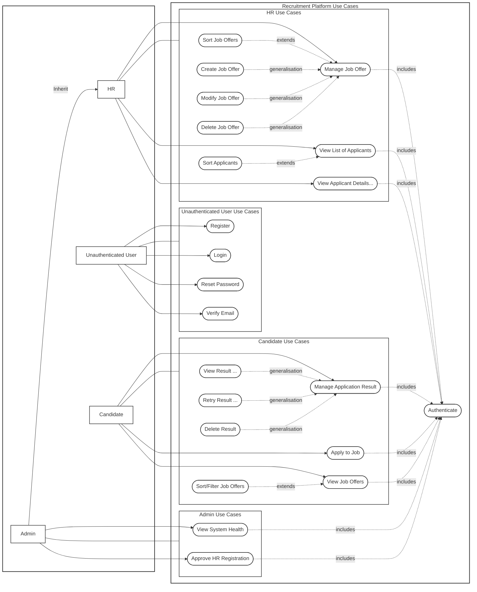

```mermaid
flowchart LR
    %% Actors Boundary
    subgraph Actors[" "]
        direction TB
        HR[HR]
        Unauth[Unauthenticated User]
        Candidate[Candidate]
        Admin[Admin]
        
        Admin -- Inherit --> HR
    end

    %% Main System Boundary
    subgraph System["Recruitment Platform Use Cases"]
        direction LR

        %% Unauthenticated User Group
        subgraph Unauth_UC["Unauthenticated User Use Cases"]
            direction TB
            Register([Register])
            Login([Login])
            ResetPwd([Reset Password])
            VerifyEmail([Verify Email])
        end

        %% HR Group
        subgraph HR_UC["HR Use Cases"]
            direction TB
            SortJobOffers([Sort Job Offers])
            CreateJobOffer([Create Job Offer])
            ModifyJobOffer([Modify Job Offer])
            DeleteJobOffer([Delete Job Offer])
            
            ManageJobOffer([Manage Job Offer])
            
            SortApp([Sort Applicants])
            ViewListApp([View List of Applicants])
            ViewAppDetails([View Applicant Details...])
        end

        %% Candidate Group
        subgraph Candidate_UC["Candidate Use Cases"]
            direction TB
            ViewResult([View Result ...])
            RetryResult([Retry Result ...])
            DeleteResult([Delete Result])
            
            ManageAppResult([Manage Application Result])
            
            ApplyJob([Apply to Job])
            
            SortFilterJob([Sort/Filter Job Offers])
            ViewJobOffers([View Job Offers])
        end

        %% Admin Group
        subgraph Admin_UC["Admin Use Cases"]
            direction TB
            ViewHealth([View System Health])
            ApproveHR([Approve HR Registration])
        end

        Authenticate([Authenticate])
    end

    %% ----------------------------------------------------
    %% Layout positioning
    %% ----------------------------------------------------
    HR --- HR_UC
    Unauth --- Unauth_UC
    Candidate --- Candidate_UC
    Admin --- Admin_UC

    %% Primary Actor to Use Case Connections
    HR --> ManageJobOffer
    HR --> ViewListApp
    HR --> ViewAppDetails

    Unauth --> Register
    Unauth --> Login
    Unauth --> ResetPwd
    Unauth --> VerifyEmail

    Candidate --> ManageAppResult
    Candidate --> ApplyJob
    Candidate --> ViewJobOffers

    Admin --> ViewHealth
    Admin --> ApproveHR

    %% ----------------------------------------------------
    %% Internal Use Case Relationships
    %% ----------------------------------------------------
    SortJobOffers -. extends .-> ManageJobOffer
    CreateJobOffer -. generalisation .-> ManageJobOffer
    ModifyJobOffer -. generalisation .-> ManageJobOffer
    DeleteJobOffer -. generalisation .-> ManageJobOffer

    SortApp -. extends .-> ViewListApp

    ViewResult -. generalisation .-> ManageAppResult
    RetryResult -. generalisation .-> ManageAppResult
    DeleteResult -. generalisation .-> ManageAppResult

    SortFilterJob -. extends .-> ViewJobOffers

    %% ----------------------------------------------------
    %% Includes (Authentication)
    %% ----------------------------------------------------
    ManageJobOffer -. includes .-> Authenticate
    ViewListApp -. includes .-> Authenticate
    ViewAppDetails -. includes .-> Authenticate
    ManageAppResult -. includes .-> Authenticate
    ApplyJob -. includes .-> Authenticate
    ViewJobOffers -. includes .-> Authenticate
    ViewHealth -. includes .-> Authenticate
    ApproveHR -. includes .-> Authenticate

    %% ----------------------------------------------------
    %% Aesthetics & Styling
    %% ----------------------------------------------------
    classDef default fill:#fff,stroke:#333,stroke-width:1.5px;
    
    style Actors fill:none,stroke:#333,stroke-width:2px;
    style System fill:none,stroke:#333,stroke-width:2px;
    
    style Unauth_UC fill:none,stroke:#333,stroke-width:1.5px;
    style HR_UC fill:none,stroke:#333,stroke-width:1.5px;
    style Candidate_UC fill:none,stroke:#333,stroke-width:1.5px;
    style Admin_UC fill:none,stroke:#333,stroke-width:1.5px;
```